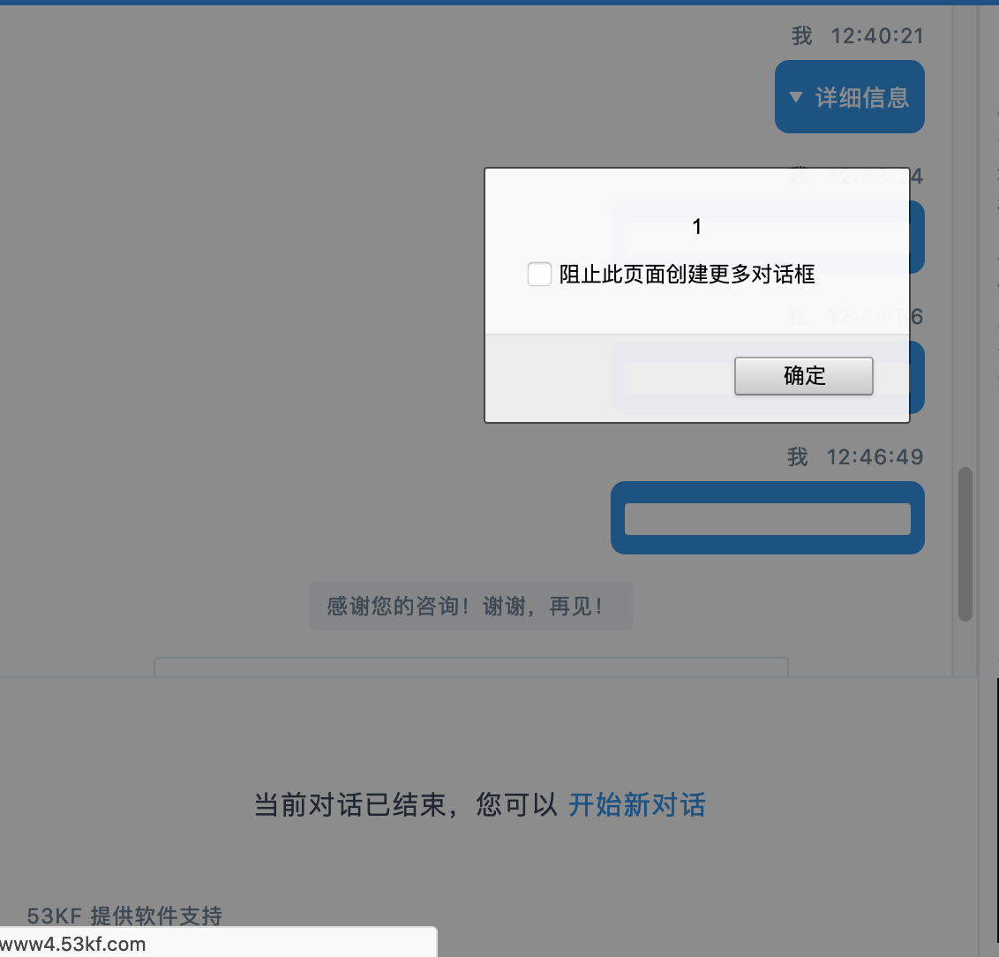

## 53KF_vuln_xss
### CVE ID 
CVE-2020-28119
## Info ：
When using the 53KF online chat system, it is found that the inserted HTML statements can be successfully executed, and the alarm window and JS script can be executed successfully, thus stealing customer service staff cookies or fishing operations.

## description ：

Cross Site Scripting (XSS) vulnerability in 53KF online chat system product, Affecting versions < 2.0.0.2 . The vulnerabilities could be remotely exploited resulting in Cross-Site Scripting (XSS) or information disclosure.

Exploit Title: There is a stored Cross Site Scripting in 53KF

Date: 2020/10/27

Exploit Author: Set3r.Pan

Vendor Homepage: https://www.53kf.com 、http://www.53kf.me/

Version: < 2.0.0.2/(all)

Tested on: macOS

## POC:
```
Temporarily closed
```

## verification：
Open 53 online customer service chat window to inject POC



Close the chat window and open it again. The attack is successful

