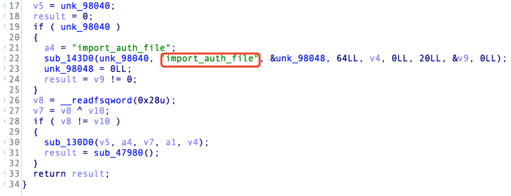
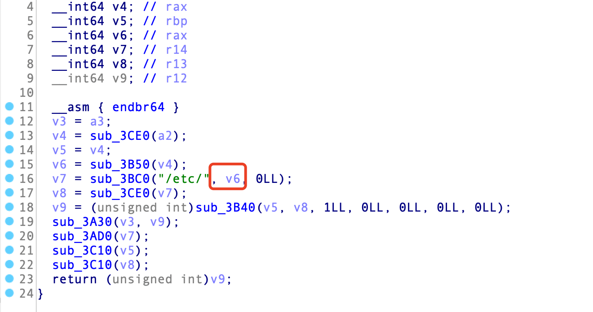

# Kylin OS privilege escalation vulnerability

Author: Set3r.Pan（8691003@qq.com）\
Unit: Kylin Software Co., Ltd.（https://www.kylinos.cn/）

### CVE ID
CVE-2023-1164
## Report
### Describe

The kylin-activation package is a component used by Kylin OS for authorization verification and activation. The software package does not strictly restrict the legality of the import file operation, so the directory where the system configuration file is located is imported into an illegal configuration file, resulting in the elevation of local privileges of ordinary users.


### Hazard level
High
### Affected version
- Desktop：kylin-activation < 1.3.11-23
- Server：kylin-activation < 1.30.10-5.p23
### POC&&EXP
ISO Download:\
https://distro-images.kylinos.cn:8802/web_pungi/download/share/HXDYtGjZm3daA4UvOTLkiPl1nB9ErM0c/

exp.sh
```
Temporarily closed
```
### Vuln details
org.freedesktop.activation::import_auth_file receive files



If the file exists, the service copies the file to /etc, causing arbitrary files to be written in the /etc directory


